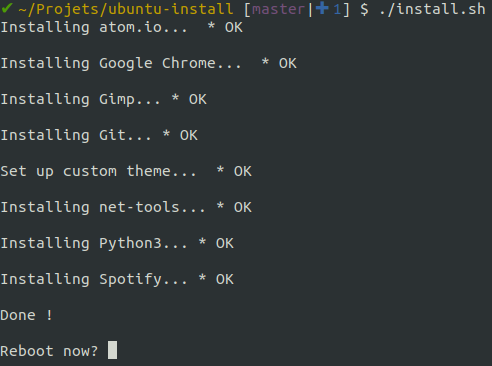

# UBUNTU INSTALL

## DESCRIPTION
This repository contains shell scripts used to set up a newly installed Ubuntu with a Gnome desktop environment (default environment in Ubuntu 18.4).

It contains two main scripts:
*  `install_functions.sh`: a set of functions used to handle the execution of consecutives shell commands and check their return status. The status is then displayed in the terminal (OK, FAIL, ...).
It was adapted for Ubuntu from [the RedHat/CentOS code from John Kugelman on StackOverflow](https://stackoverflow.com/a/5196220).
* `install.sh`: the actual installation script, that sets up the installation and call each module installation script.

## MODULES

The modules are individual actions, available in a single bash script. Each module must have its own folder in the `modules` directory, and each module folder should contain at least a `install.sh` script that will be called by the main installer.

Modules currently available are:

* Google Chrome
* Atom.io
* Git
* Gimp
* Customize Gnome by:
  * setting a desktop, lock screen and login page wallpaper (the same image)
  * setting a dock icon size
  * setting dock items ("favourites"), including link to Gmail
  * setting terminal colors

All the values used for customization can be changed through variables defined in the script.
